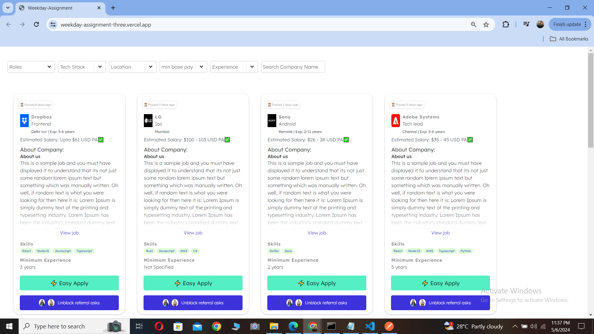
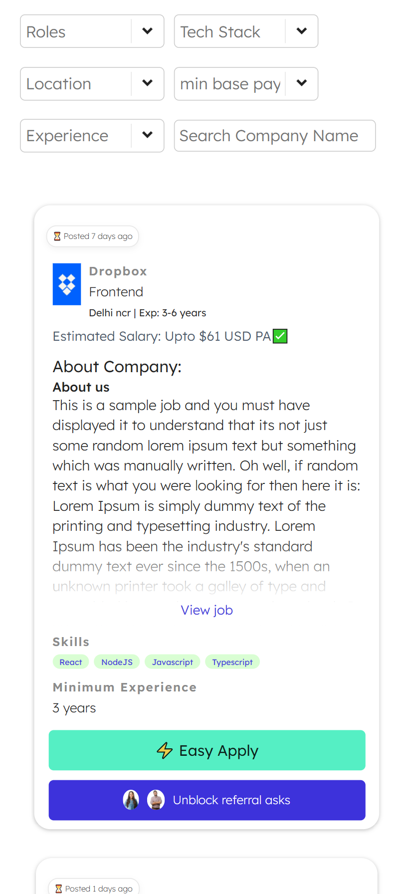

<h1 align="center">Weekday Assignment</h1>
<p align="center">Time taken: 05/05/24 (02:00 AM) - 07/05/24 (12:30 AM)</p>

### Features

- Filters are implemented to filter your search based on Roles, Tech Stack, Location, Minimum Base Pay, Experience, Company Name
- Job Cards are implemented as per design to view the information

### Highlights

- well structured, readable, and maintainable code
- Responsive design principles are implemented to fit in all devices
- Null values are perfectly handled in the logic


## Dont want to run the assignment in local environment? I got you!!

Visit the website to view the assignment: https://weekday-assignment-three.vercel.app/

I would really appreciate to get some suggestions and corrections in my assignment

### Main Page - Desktop



### Main Page - Mobile




## Technology Stack

- **Coding Languages**:   

- **Tools & Frameworks**:  

- **Project Management Tools**:  

<hr>

## Environment Setup for local use-


- Download and install a code/ text editor. - Recommended- - [Download VS Code](https://code.visualstudio.com/download) 
  <br/>

- Download [Node Js and npm(Node package manager)](https://nodejs.org/en/) (when you install Node, npm also gets installed by default)
  <br/>


- Download and extract the github repositor
<br/>

- Open the project (weekday_assignment-main) using VS Code
  <br/>

- Open a new terminal and run this command to install all dependencies for the frontend of this project.

```
npm install
```

<br/>

- Now run this command to start the project.

```
npm start
```
<br/>

- Now you are all set to use this project.

## Developer

- Md Riyaz Ahmed
